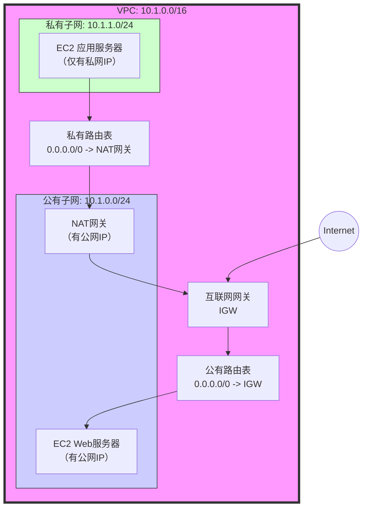
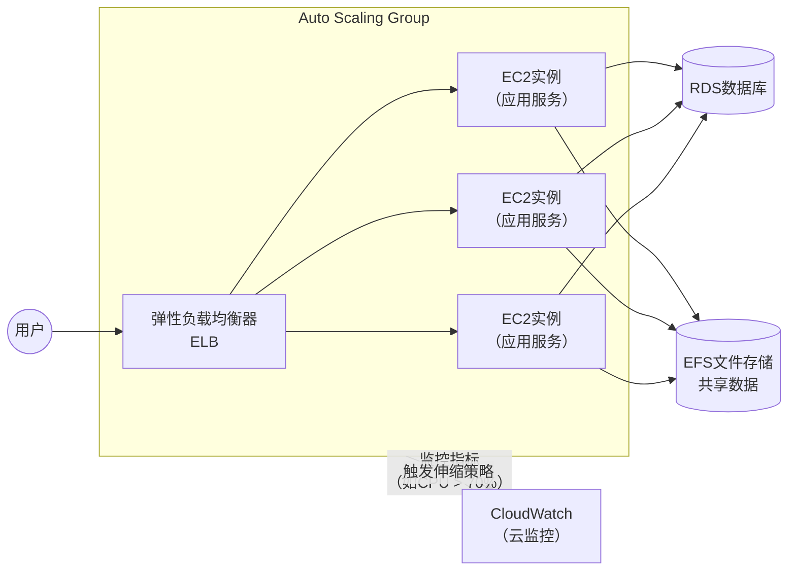

> https://docs.aws.amazon.com/

# AWS 云服务核心指南 (Java架构师视角)

> **目标**：从Java开发者的角度，理解AWS的核心服务、架构模式和最佳实践。

---

## 1. 热身：AWS的“世界观”

*   **核心支柱**：AWS的设计围绕**安全性、可靠性、性能效率、成本优化、卓越运营**五大支柱。理解这五点，就抓住了AWS的“灵魂”。

*   **全局服务 (IAM)**：**身份与访问管理**是AWS的“门卫”。它控制谁能（`Principal`）对什么资源（`Resource`）执行什么操作（`Action`）。记住：**最小权限原则**。为应用程序（如EC2）分配角色（`Role`），而非使用访问密钥，是更安全、优雅的做法。

*   **区域 (Region) 与可用区 (AZ)**：这是AWS物理基础设施的基石，也是实现**高可用**和**容错**的关键。
    *   **Region**：全球各个独立的地理区域（如 `us-east-1`, `cn-north-1`）。
    *   **AZ**：每个Region内的一个或多个隔离的数据中心。将应用部署到**多个AZ**，是抵御单点故障的黄金法则。

---

## 2. 网络基石：VPC (Virtual Private Cloud)

> 这是您在AWS云中专属的、逻辑隔离的网络“家园”。理解VPC是部署任何复杂应用的前提。

### 2.1 VPC核心组件图解

### 关键概念解析

*   **子网 (Subnet)**：VPC内划分的IP地址段，必须属于一个AZ。
    *   **公有子网**：有通往Internet的路由，通常部署负载均衡器、NAT网关等。
    *   **私有子网**：无直接Internet路由，安全性高，部署应用服务器和数据库。
*   **互联网网关 (IGW)**：VPC连接Internet的“大门”。
*   **NAT网关 (NAT Gateway)**：为**私有子网**中的服务器提供**主动访问**Internet的能力（如下载补丁），但阻止外部直接访问。
*   **路由表 (Route Table)**：决定网络流量走向的“地图”。
*   **安全组 (Security Group)**：实例级别的“虚拟防火墙”，**有状态**（允许入站则自动允许出站）。您只需关注**允许**哪些流量。
*   **网络ACL (NACL)**：子网级别的“防火墙”，**无状态**（需分别配置出入站规则）。通常作为安全组的补充防线。

---

## 3. 计算核心：EC2, ASG 与 ELB

> 这是AWS最核心的计算服务，通过组合使用，可以构建出弹性、高可用的应用集群。

### 3.1 弹性伸缩架构

### 概念拆解

*   **EC2 (Elastic Compute Cloud)**：即云中的虚拟机。选择时需关注**实例类型**（CPU/内存比）和**AMI**（操作系统镜像）。
*   **ELB (Elastic Load Balancing)**：流量分发器。作为Java应用，您最常用的是**应用负载均衡器 (ALB)**，它支持基于HTTP/HTTPS的7层路由，可以按路径（如 `/api/*`）转发请求。
*   **ASG (Auto Scaling Group)**：弹性伸缩组。它根据**CloudWatch**的监控指标（如CPU利用率、请求数），自动增加或减少EC2实例数量。
    *   **黄金法则**：将EC2实例视为“**牲畜**”而非“**宠物**”。它们是无状态的，可以随时被替换。所有持久化数据应存储在外部服务（如RDS, S3, EFS）。

---

## 4. 存储三剑客：S3, EBS, EFS

| 服务 | 类型 | 核心特点 | 适用场景 | Java开发者视角 |
| :--- | :--- | :--- | :--- | :--- |
| **S3** | **对象存储** | 海量、便宜、高可用。存储的是“文件+元数据”，通过Key（路径）访问。 | 静态网站托管、备份归档、大数据湖、日志存储。 | 存放用户上传的图片、应用日志、配置文件。访问通过AWS SDK。 |
| **EBS** | **块存储** | 类似服务器的“硬盘”。**只能挂载到同一AZ的一个EC2实例**。 | 作为EC2实例的系统盘或数据盘，运行数据库。 | 相当于 `C:` 盘或 `/dev/xvdf`。注意其性能与类型（如gp3, io1）有关。 |
| **EFS** | **文件存储** | 类似NFS网络文件系统。**可同时挂载到多个EC2实例**。 | 多个服务器间需要共享的代码、配置文件、上传文件目录。 | 相当于一个共享的网络驱动器，解决了无状态应用的数据共享问题。 |

---

## 5. 数据库服务：RDS

*   **RDS (Relational Database Service)**：托管的关系型数据库服务。支持MySQL, PostgreSQL, Oracle, SQL Server等。
*   **核心优势**：AWS负责底层运维（备份、补丁、监控），您只需关注表结构和SQL。
*   **高可用方案**：**Multi-AZ部署**，会同步复制一个**备用实例**到另一个AZ，实现故障自动切换。
*   **读写分离**：通过**只读副本 (Read Replica)** 来分担主库的读压力，适合读多写少的Java应用。

---

## 6. 容器与无服务器：ECS, EKS, Lambda

*   **ECS / EKS**：容器编排服务。如果您希望掌控底层，可以选择**EC2启动模式**；如果希望完全免运维，可以选择**Fargate启动模式**（Serverless），无需管理底层服务器。
*   **Lambda**：**真正的无服务器计算**。您只需上传代码（Java支持良好），它会在事件触发时执行，按运行时间和次数付费。完美契合微服务、事件驱动、短时任务等场景。

---

## 总结：AWS 实践核心流程

对于Java开发者，部署一个高可用Web应用的典型流程是：

1.  **网络**：创建VPC，划分**公有子网**（放ELB）和**私有子网**（放应用服务器和数据库）。
2.  **安全**：设置**安全组**，严格限制端口访问（如只允许ELB访问应用服务器的8080端口）。
3.  **计算**：编写**启动脚本 (User Data)** 以初始化环境，并将应用部署到EC2（或打成镜像放入ECS/EKS）。
4.  **存储**：静态资源存S3，共享文件存EFS，业务数据存RDS。
5.  **弹性**：创建ELB和ASG，配置基于CPU或请求数的自动伸缩策略。
6.  **运维**：通过**CloudWatch**配置告警，通过**IAM角色**赋予服务所需权限。**基础设施即代码**（Terraform或CloudFormation）是保持环境一致性的专业之选。

---

> 这份指南旨在帮助您快速建立AWS知识脉络。如需深入特定服务的架构原理或代码集成，可随时展开探讨。
