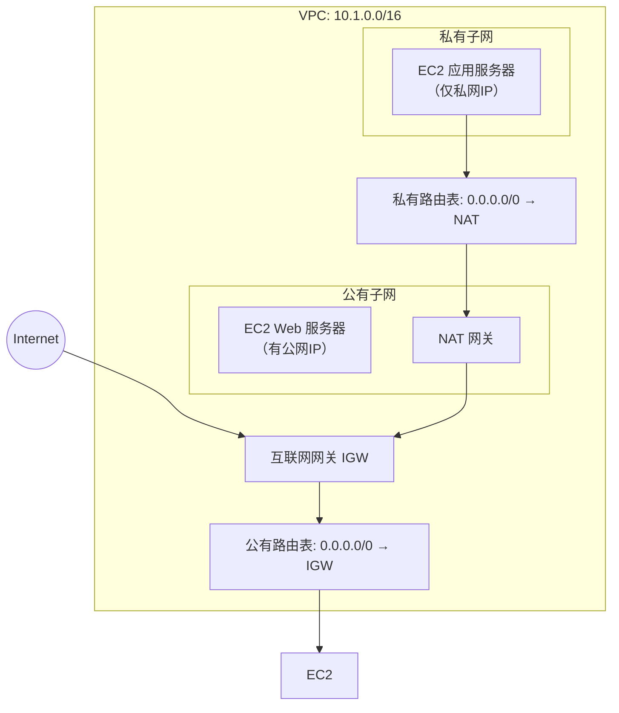
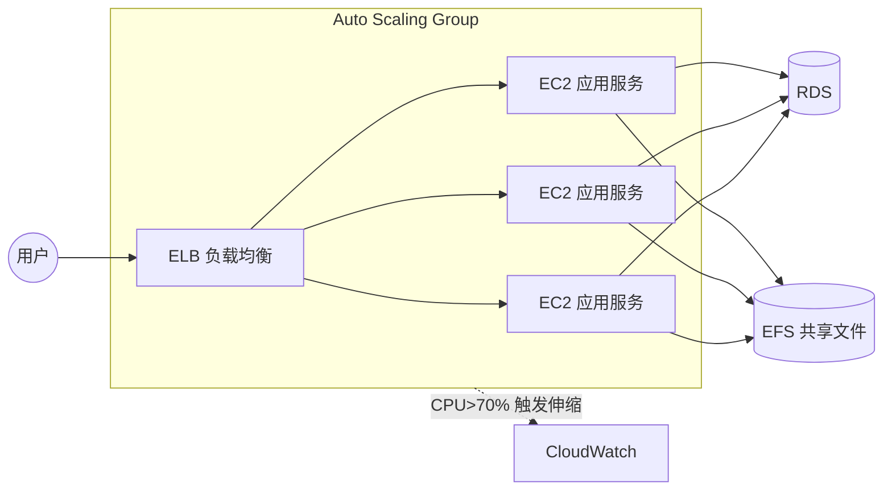

> 从 Java 开发者的角度理解 AWS：**安全、可靠、性能效率、成本优化、卓越运维**。官网：https://docs.aws.amazon.com/

---

# 一、全局世界观（先建立地图）

- **Region / AZ**：Region（如 `us-east-1`）内又分多个 **AZ**（隔离的数据中心）。部署到多个 AZ = 高可用，是抵御单点故障的黄金法则。
- **IAM**：AWS 的"门卫"，控制"谁(Principal) 能对什么(Resource) 做什么(Action)"。原则：**最小权限**，给 EC2 等应用配 **Role**，别把 Access Key 写死在代码里。
- 一句话理解：**IAM 决定你"有没有权"，被访问的资源（如 bucket policy）决定"允不允许"。**

---

# 二、网络基石：VPC

> 你在 AWS 云里专属的逻辑隔离网络。**创建顺序**：VPC → 子网 → 网段路由 → IGW/NAT → 关联路由表 → 绑定 EC2。CIDR 例：`10.1.0.0/16` = 前 16 位固定的 IP 段。



| 组件 | 一句话 |
|---|---|
| 子网 Subnet | VPC 内的 IP 段，属一个 AZ；**公有子网**放 ALB/NAT，**私有子网**放应用和数据库 |
| IGW 互联网网关 | VPC 连公网的"大门" |
| NAT 网关 | 给私有子网"主动外联"（下补丁）的能力，但挡住外部直入，放在公有子网 |
| 路由表 | 流量走向的"地图" |
| 安全组 SG | 实例级防火墙，**有状态**（入站放行则自动放行出站），只需配允许 |
| NACL | 子网级防火墙，**无状态**（出入都要配），作为安全组补充 |


---

# 三、计算核心：EC2 + ELB + ASG



- **EC2**：云上虚拟机。选型看**实例类型**（CPU/内存比例）和 **AMI**（系统镜像）。登录：
  ```sh
  ssh -i Ec2.pem ec2-user@35.180.242.162
  ```
- **ELB**：流量分发器。Java 最常用 **ALB**（7 层），可按路径 `/api/*` 转发。
- **ASG**：按 CloudWatch 指标自动扩缩 EC2。把 EC2 当"**牲畜**不是**宠物**"——随时可换，数据都放外部（RDS/S3/EFS）。

**EC2 三个易混概念：**
- **公网 IP**：每次 stop/start 会变；想固定用 **Elastic IP**，但优先用域名(配 DNS) 更优雅
- **Placement Groups**：决定 EC2 的物理部署策略（同机架 / 跨 AZ）
- **ENI 弹性网卡**：EC2 的"网卡"，可独立创建、可迁移到另一台 EC2（故障迁移用）

---

# 四、存储：S3 / EBS / EFS

| 服务 | 类型 | 特点 | Java 视角 |
|---|---|---|---|
| **S3** | 对象存储 | 海量、便宜、高可用，存"文件+元数据"，用 **Key**（路径）访问，**没有目录概念** | 上传图片、日志、静态网站 |
| **EBS** | 块存储 | 像服务器硬盘，**只能挂一个 EC2**，且同 AZ | EC2 系统盘/数据盘 |
| **EFS** | 文件存储 | 像 NFS，**可同时挂多个 EC2** 共享 | 多应用共享的上传目录 |

**S3 要点：** bucket 名全局唯一；key = 前缀+文件名；对象最大 5TB；开启**版本管理**防误删。
**权限补充：** IAM 允许但你 bucket policy 显式 Deny，仍不能访问（两者同时生效）。

---

# 五、数据库：RDS

- 托管关系型数据库（MySQL/PostgreSQL/Oracle/SQLServer），**AWS 管运维**（补丁、备份、监控），你只管表结构和 SQL
- **高可用**：Multi-AZ 部署，另一 AZ 自动同步一个备用实例，故障自动切换
- **读写分离**：Read Replica 只读副本分担读压力，适合读多写少

---

# 六、容器与无服务器：ECS / EKS / Lambda

- **ECS**：AWS 自家的容器编排。两种模式：**EC2 启动**（可控底层） vs **Fargate**（无服务器，只管任务）
- **EKS**：**托管 Kubernetes**，更通用，推荐用它管理容器；同样支持 EC2 / Fargate
- **ECR**：AWS 的镜像仓库（对标 Docker Hub）
- **Lambda**：函数即服务，传 Java 代码，事件触发、按调用计费——微服务/短任务很合适

---

# 七、其它常用服务（了解即可）

| 服务 | 干什么 |
|---|---|
| **Route 53** | AWS 的 DNS + 域名注册 + 健康检查 |
| **SQS** | 消息队列（解耦异步） |
| **SNS** | 发布/订阅（通知、消息推送） |
| **CloudFront** | CDN 加速 |
| **Systems Manager** | 远程会话管理（免 SSH/密码）、Parameter Store 存密钥、补丁管理 |

---

# 八、基础设施即代码：Terraform

> 用代码创建云基础设施，状态可版本化管理。参考：https://registry.terraform.io/providers/hashicorp/aws/latest/docs

## 8.1 基础命令

```sh
terraform init      # 初始化（下载 provider）
terraform plan      # 变更预览（生产环境先跑这个）
terraform apply     # 应用变更，创建/修改资源
terraform destroy   # 销毁之前 apply 的资源
```

## 8.2 状态文件 tfstate（重点）

- `apply` 后把状态写入 `terraform.tfstate`；再 apply 时无变化不会重复执行
- **⚠️ 删了这个文件 = 资源泄漏**：Terraform 会以为从没建过，再建一批，而旧资源永远无法 destroy 回收
- **tfstate 是明文**（可能含密码）→ 用动态机密管理（Vault / Secrets Manager），或配远程 Backend

```hcl
# S3 作为共享后端（多人协作）
terraform {
  backend "s3" {
    bucket = "tfstate-xxx"
    key    = "demo/terraform.tfstate"
    region = "ap-southeast-1"
  }
}
```

## 8.3 变量

```hcl
variable "buckets" {
  type = list(object({    # 复杂类型支持 list/map/object
    name = string
  }))
}
```

```sh
terraform apply -var="image_id=ami-123456"    # 命令行传入
terraform apply -var-file="testing.tfvars"    # 或 tfvars 文件
# 模块目录下默认读取 terraform.tfvars，也可用 TF_VAR_<名称> 环境变量
```

---

# 九、常用概念速记

| 概念 | 一句话 |
|---|---|
| **Elastic IP** | 固定公网 IP，stop/start 不变；超配额要付费，优先用域名(→DNS)替代 |
| **Security Group** | EC2 虚拟防火墙，**只配允许**，改规则立即生效免重启，其余隐式拒绝 |
| **VPC Endpoint** | 私有子网不经过公网直接访问 AWS 服务（S3/DB），更安全、低延迟 |
| **IAM Credentials Report** | 账号级审计：列出所有用户的凭证状态 |
| **Systems Manager** | 记忆点：Session Manager 免密远程连 EC2 + Parameter Store 存密钥 |

---

# 十、Java 应用部署到 AWS 的完整流程

1. **网络**：建 VPC，公有子网放 ELB，私有子网放应用和数据库
2. **安全**：安全组只放端口（如只允许 ELB 访问应用 8080）
3. **计算**：EC2 用启动脚本（User Data）初始化，或打成镜像放到 ECS/EKS
4. **存储**：静态→S3，共享文件→EFS，业务数据→RDS
5. **弹性**：ELB + ASG 按 CPU/请求数自动伸缩
6. **运维**：CloudWatch 告警、IAM Role 授权、Terraform 统一管理基础设施

---

# reference

- AWS 文档：https://docs.aws.amazon.com/
- AWS 基础概念：https://aws.amazon.com/cn/getting-started/fundamentals-core-concepts/
- Terraform 文档：https://registry.terraform.io/providers/hashicorp/aws/latest/docs
- Terraform 脚本参考：https://github.com/zljin/document/tree/master/script/devops/terraform